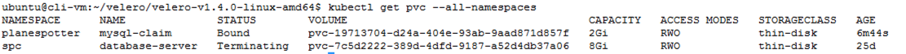

VMware Advanced Customer Engagements (ACE) Team

June 2020

Table of Contents 
=================

[Introduction 3](#introduction)

[Kubernetes 3](#kubernetes)

[Velero 3](#velero)

[Use-case 6](#use-case)

[Assumptions 7](#assumptions)

[Setup Minio 8](#setup-minio)

[Setup Velero 13](#setup-velero)

[Download Velero 13](#download-velero)

[Install Velero 14](#install-velero)

[Backup the Source Cluster 22](#backup-the-source-cluster)

[Restore to the Target Cluster 31](#restore-to-the-target-cluster)

[Snapshots 36](#snapshots)

[Conclusion 38](#conclusion)

Introduction
============

This document is a quickstart guide for backing up a Tanzu Kubernetes
Grid Integrated (TKGI, formerly known as Enterprise PKS) Kubernetes
cluster and restoring it. This document will provide details on Valero
backup software, installing Velero, and backing up an existing cluster,
and restoring to the same or another target cluster. The cluster backup
will include all Kubernetes (K8) resources as well as persistent
volumes.

Kubernetes
==========

Kubernetes is a portable, extensible, open-source platform for managing
containerized workloads and services, that facilitates both declarative
configuration and automation. 

Kubernetes provides you with a framework to run distributed systems
resiliently. It takes care of scaling and failover for your application,
provides deployment patterns and more.

Kubernetes thus allows us to run a containerized application at scale.
Running multiple replicas of the application ensures its high
availability. Although Kubernetes provides HA with replicas, and zero
downtime deployments, as with all platforms, we could face situations
wherein a cluster can go into an unrecoverable state.

Kubernetes allows us to have a zero-downtime deployment, yet service
interrupting events are inevitable and can occur at any time. Your
network can go down, your latest application push can introduce a
critical bug, or in the rarest case, you might even have to face a
natural disaster.

We will hence require setting up a backup and recovery process to go
back to the previously known stable state. Also, this process is useful
to migrate workloads/cluster resources from one cluster to another etc.

Velero
======

Running on Kubernetes clusters or on VMs, Velero gives you tools to back
up and restore your Kubernetes cluster resources and persistent volumes.
You can run Velero in Kubernetes clusters from a cloud provider or
on-premises. Velero lets you:

-   Take backups of your cluster and restore in case of loss.

-   Migrate cluster resources to other clusters.

-   Replicate your production cluster to development and test clusters.

Velero consists of:

-   A server that runs on your cluster

-   A command-line client that runs locally

**Disaster Recovery**

If you periodically back up your cluster\'s resources, you are able to
return to a previous state in case of some unexpected mishap, such as a
service outage. 

**Cluster Migration**

Velero can help you port your resources from one cluster to another, as
long as you point each Velero instance to the same cloud object storage
location. 

**Backup Reference**

It is possible to exclude individual items from being backed up, even if
they match the resource/namespace/label selectors defined in the backup
spec.

**Restore Reference**

Velero can restore resources into a different namespace than the one
they were backed up from.

**How it Works**

**On-demand backups**

-   Uploads a tarball of copied Kubernetes objects into cloud object
    storage.

-   Calls the cloud provider API to make disk snapshots of persistent
    volumes, if specified.

**Scheduled backups**

-   The **schedule** operation allows you to back up your data at
    recurring intervals

**Restores**

The **restore** operation allows you to restore all of the objects and
persistent volumes from a previously created backup. You can also
restore only a filtered subset of objects and persistent volumes.


**Backup workflow**

When you run Velero backup

-   The Velero client makes a call to the Kubernetes API server to
    create a Backup object.

-   The BackupController notices the new Backup object and performs
    validation.

-   The BackupController begins the backup process. It collects the data
    to back up by querying the API server for resources.

The BackupController makes a call to the object storage service \-- for
example, AWS S3 \-- to upload the backup

By default, Velero backup create makes disk snapshots of any persistent
volumes. You can adjust the snapshots by specifying additional flags.
Run Velero backup create \--help to see available flags. Snapshots can
be disabled with the option \--snapshot-volumes=false.


You can run Velero in Kubernetes clusters on a cloud provider or
on-premises. For detailed information, see [Compatible Storage
Providers](https://velero.io/docs/v1.0.0/support-matrix/). Each Velero
operation \-- on-demand backup, scheduled backup, restore \-- is a
custom resource, defined with a Kubernetes [Custom Resource Definition
(CRD)](https://kubernetes.io/docs/concepts/api-extension/custom-resources/#customresourcedefinitions) and
stored in etcd. Velero also includes controllers that process the custom
resources to perform backups, restores, and all related operations. You
can back up or restore all objects in your cluster, or you can filter
objects by type, namespace, and/or label.

Restic inherently is a file-based backup. Currently, on a vSphere
environment Velero uses Restic to backup Kubernetes Persistent Volumes
(PV's) by taking the backup of all the files.

For more information go to https://[velero.io](https://velero.io/)

Use-case 
========

For migrations or disaster recovery or maintenance, backup a Kubernetes
cluster and restore its resources from a backup to a target cluster.


 Assumptions
===========

The following assumptions are made in the guide:

-   TKGI is deployed

-   The infrastructure team has setup 3 K8s clusters , the source
    cluster  (where Velero backup is made from ) , the target (where the
    Velero backup is restored to) cluster and an infra cluster where all
    infrastructure applications like Minio and Prometheus will be
    running .

> NOTE: This is not a hard and fast rule, Minio can run on any cluster,
> including the source and the target cluster, it could also be run as a
> standalone vm. For more information on minio visit
> [*https://docs.min.io/*](https://docs.min.io/)

-   The Minio backup endpoint is accessible from both the source and
    target clusters.

-   A Linux/ubuntu machine is provisioned to install and use various
    software components

-   The provisioned Linux/ubuntu machine meets the following

    -   Can access all the 3 K8s clusters defined above

    -   Has the appropriate kubectl cli installed

    -   Has the appropriate pks cli installed

    -   Has the latest version of
        [Helm](https://github.com/helm/helm/releases) installed

-   In this document, we will be using ci-cluster as our source cluster
    and my-cluster as our target cluster.

-   The source K8s clusters have applications deployed

-   A sample application is planespotter
    (<https://github.com/CNA-Tech/PKS-Ninja/tree/master/LabGuides/DeployPlanespotter-DP6539>)

Setup Minio
===========

We will be setting up Minio in the infra structure cluster. This is not
a hard and fast rule, Minio can run on any cluster, including the source
and the target cluster, it could also be run as a standalone vm.. We
will be using the Bitnami official Minio images for K8. The steps below
describe how to setup Minio in a K8 cluster using the bitnami
distribution.

**Step 1:** ssh to the provisioned ubuntu vm.

**Step 2:** Get kube config for the infra cluster

> pks get-kubeconfig infra-cluster -a \<pks api\> -u \<user\> -p \<password\> -k

> E.g.

> pks get-kubeconfig infra-cluster -a pks.corp.local -u riaz -p VMware1! -k

**Step 3:** Create as namespace to which minio can be deployed

> kubectl create ns minio

**Step 4:** Add Bitnami helm repository

Helm repo add Bitnami https://charts.bitnami.com/bitnami

**Step 5:** Minio requires a backing store / K8s persistent volume.
Create a storage-class on the infra cluster with the following storage
class definition. Copy the contents of the file below to a file
storage-class.yaml and create the storage class.

<details><summary>storage-class.yaml</summary>

```yaml
---
kind: StorageClass
apiVersion: storage.k8s.io/v1
metadata:
  name: minio-disk
provisioner: kubernetes.io/vsphere-volume
parameters:
    diskformat: thin
```

</details>
<br/>

> kubectl apply -f storage-class.yaml


**Step 6:** Deploy the Bitnami Minio release. This will create the
necessary resources to run Minio within the minio namespace

> heml install minio-release -n minio \\
>\--set access.Key.password=minio \\
>\--set secretKey.password=minio123 \\
>\--set persistence.storageClass=minio-disk \\
>bitnami/minio

**Step 7:** Check for all pods, deployments and services and make sure
everything is created and the pods are running as expected. Also check
if the PVC is created and bound

kubectl get all -n minio

kubectl get pvc -n minio

kubectl get deployment -n minio


**Step 8:** Expose the deployment as a loadbalancer. This will create
any lb within NSXT as an ingress.

> kubectl expose deployment minio-release \--name=minio-frontend-lb
> \--port=80 \--target-port=9000 \--type=LoadBalancer \--namespace=minio

**Step 9:** Check the IP under the "External-IP" section, point your
browser to the location \<external-ip\>. The Minio application should be
accessible

kubectl get svc -n minio

{width="7.5in" height="0.7111111111111111in"}


**Step 10:** Login with the credentials used in step 6. - minio/minio123


**Step 11:** Create a bucket called Velero. We will be using this bucket
when we install Velero to the clusters in the following steps:


{width="7.5in" height="3.7875in"}


Setup Velero
============

This section goes through the steps to download Velero to the
provisioned Ubuntu vm and install Velero on both the source and target
clusters.

Download Velero
---------------

**Step 1:** Navigate to the official page of Velero
(<https://github.com/vmware-tanzu/velero/releases>) and copy the link
for the target VM OS. (Eg.
<https://github.com/vmware-tanzu/velero/releases/tag/v1.4.0>). At the
bottom of the page the official releases are listed, Right clink on the
release link 'Copy Link address'


**Step 2:** ssh to the provisioned ubuntu vm.

**Step 3**: Download and uncompress the Velero distribution

mkdir velero

cd \~/velero

wget
<https://github.com/vmware-tanzu/velero/releases/download/v1.4.0/velero-v1.4.0-linux-amd64.tar.gz>

tar xvf velero-v1.4.0-linux-amd64.tar.gz

Install Velero
--------------

This section describes the steps required to install Velero to both the
source and target clusters. Any cluster from which a backup is taken or
to which a backup is restored requires to have Velero deployed to it.

**Source Cluster**

Source cluster is the cluster from which a Velero backup will be taken
from**.** As mentioned in the assumptions section we will be using the
ci-cluster as our source cluster.

**Step 1:** ssh into the provisioned linux/ubuntu vm

**Step 2:** Get kube config for the source cluster

pks get-kubeconfig \<source-cluster\> -a \<pks api\> -u \<user\> -p
\<password\> -k

E.g.

pks get-kubeconfig ci-cluster -a pks.corp.local -u riaz -p VMware1! -k


**Step 3:** Create a velero namespace

kubectl create ns velero

**Step 4:** Change directory to the velero directory

cd \~/velero/velero-v1.4.0-linux-amd64

**Step 5:** Create a credentials file. Name it credentials This will
contain the username and password used for Minio. The values would be
the same as what was provided during the Minio setup.

\[default\]

aws\_access\_key\_id = minio

aws\_secret\_access\_key = minio123

**Step 6:** Set kubectl context to the source cluster

kubectl config use-context \<source-cluster\>

> E.g.\
> kubectl config use-context ci-cluster

**Step 7:** Install Velero to the source cluster.

> ./velero install \\\
> \--provider aws \\\
> \--plugins velero/velero-plugin-for-aws:v1.0.0 \\\
> \--bucket velero \\\
> \--secret-file ./credentials \\\
> \--use-volume-snapshots=false \\\
> \--use-restic \\\
> \--backup-location-config
> region=minio,s3ForcePathStyle=\"true\",s3Url=*\>*

Note: the secret file points to location of the file credentials file we
created above

use restic to backup pv's the s3Url points to the Minio that was setup
earlier

E.g.

> ./velero install \\\
> \--provider aws \\\
> \--plugins velero/velero-plugin-for-aws:v1.0.0 \\\
> \--bucket velero \\\
> \--secret-file ./credentials \\\
> \--use-volume-snapshots=false \\\
> \--use-restic \\\
> \--backup-location-config
> region=minio,s3ForcePathStyle=\"true\",s3Url=http://10.40.14.136


**Step 8:** Get status of pods in the velero namespace

kubectl get po -n velero

**Step 9:** If the Restic pods fail to startup we will need to edit the
hostpath for the Restic pods

kubectl edit daemonset restic -n velero

change hostPath from /var/lib/kubelet/pods to
/var/vcap/data/kubelet/pods:

Which will look like below

-hostPath:

path: /var/vcap/data/kubelet/pods


**Target Cluster**

A target cluster is the cluster to which a Velero backup is to be
restored**.** As mentioned in the assumptions section we will be using
'my-cluster' as our source cluster

**Step 1:** ssh into the provisioned linux/ubuntu vm

**Step 2:** Get kube config for the target cluster

pks get-kubeconfig \<source-cluster\> -a \<pks api\> -u \<user\> -p
\<password\> -k

E.g.

pks get-kubeconfig my-cluster -a pks.corp.local -u riaz -p VMware1! -k


**Step 3:** Create a velero namespace

kubectl create ns velero

**Step 4:** Change directory to the velero directory

cd \~/velero/velero-v1.4.0-linux-amd64

**Step 5:** The credentials file should already exist; this would be the
same as the one created for the source cluster

\[default\]

aws\_access\_key\_id = minio

aws\_secret\_access\_key = minio123

**Step 7:** Set kubectl context to the source cluster

kubectl config use-context \<source-cluster\>

> E.g.\
> kubectl config use-context my-cluster
>
> 

**Step 6:** Install Velero to the source cluster.

> ./velero install \\\
> \--provider aws \\\
> \--plugins velero/velero-plugin-for-aws:v1.0.0 \\\
> \--bucket velero \\\
> \--secret-file ./credentials \\\
> \--use-volume-snapshots=false \\\
> \--use-restic \\\
> \--backup-location-config
> region=minio,s3ForcePathStyle=\"true\",s3Url=*\>*

Note: the secret file points to the file credentials file we created
above use restic to backup pv's the s3Url points to the Minio that was
setup earlier

E.g.

> ./velero install \\\
> \--provider aws \\\
> \--plugins velero/velero-plugin-for-aws:v1.0.0 \\\
> \--bucket velero \\\
> \--secret-file ./credentials \\\
> \--use-volume-snapshots=false \\\
> \--use-restic \\\
> \--backup-location-config
> region=minio,s3ForcePathStyle=\"true\",s3Url=http://10.40.14.136


**Step 7:** Get status of pods in the velero namespace

kubectl get po -n velero


**Step 8:** If the restic pods fail to startup we will need to edit the
hostpath for the restic pods

kubectl edit daemonset restic -n velero

change hostPath from /var/lib/kubelet/pods to
/var/vcap/data/kubelet/pods:

Which will look like below

-hostPath:

path: /var/vcap/data/kubelet/pods


Backup the Source Cluster
=========================

This section describes steps to backup a source cluster. The steps give
an overview of backing up all the resources in a cluster as well as
backing up just a namespace in a cluster

**Step 1:** Get kube config for the source cluster

pks get-kubeconfig \<source-cluster\> -a \<pks api\> -u \<user\> -p
\<password\> -k

E.g.

pks get-kubeconfig ci-cluster -a pks.corp.local -u riaz -p VMware1! -k


**Step 2:** Set kubectl context to the source cluster

kubectl config use-context \<source-cluster\>

> E.g.\
> kubectl config use-context ci-cluster

**Step 3:** Check all resources running on the source cluster

kubectl get ns


NOTE: apart from the default and system namespaces, planespotter, x1, y1
and z1 exist

kubectl get po \--all-namespaces


> NOTE: Note the pods running in the default, planespotter and the x1,
> y1 and z1 namespaces

kubectl get pv \--all-namespaces


NOTE: There is a PV in the planespotter namespace, which contains DB
data for MySQL

**Step 4:** Login to the planespotter and make sure everything is
working and the DB data is being displayed

kubectl get svc \--all-namespaces


Point the browser to the external-ip of the planespotter-frontend-lb
microservice


**Step 5:** For the planespotter app, mysql is the stateful pod that
would need to be annotated. (Volumes from mysql\_pod.yaml in the
planespotter app). All stateful pods need to be annotated

Run the following to annotate each pod that contains a volume to back up

> kubectl -n YOUR\_POD\_NAMESPACE annotate pod/YOUR\_POD\_NAME
> backup.velero.io/backup-volumes=YOUR\_VOLUME\_NAME\_1,YOUR\_VOLUME\_NAME\_2,\...

**STEP 6:** To find the Volumes for the stateful pod, identify the
stateful pod and describe it. For eg. in our example mysql-0 is the
stateful pod

kubectl describe po mysql-0 -n planespotter

The volumes are

Volumes:

**mysql-vol:**

Type: PersistentVolumeClaim (a reference to a PersistentVolumeClaim in
the same namespace)

ClaimName: mysql-claim

ReadOnly: false

**mysql-config:**

Type: ConfigMap (a volume populated by a ConfigMap)

Name: mysql-config-map

Optional: false

**mysql-start:**

Type: ConfigMap (a volume populated by a ConfigMap)

Name: mysql-start-map

Optional: false


**Step 7:** Annotate the mysql-0 pod

> kubectl -n planespotter annotate pod/\<mysql pod name from 4.3 eg.
> mysql-0\>
> backup.velero.io/backup-volumes=mysql-vol,mysql-config,mysql-start
>
> e.g.
>
> kubectl -n planespotter annotate pod/mysql-0
> backup.velero.io/backup-volumes=mysql-vol,mysql-config,mysql-start

**Step 8:** Create a backup of the whole cluster

cd \~/velero/velero-v1.4.0-linux-amd64

./velero create backup \<BACKUP NAME\>

E.g.

./velero create backup sourceclusterbk


**Step 9:** Check status of the backup

./velero backup describe \<BACKUP NAME\>

**E.g.**

./velero backup describe sourceclusterbk


**\
**

**Step 10:** Login to Minio and check if the backup has been created. \>
, e.g. http://10.40.14.43


**Step 11:** Create a backup of the planespotter namespace

cd \~/velero/velero-v1.4.0-linux-amd64

./velero backup create \<BACKUP NAME\> \--include-namespaces
\<NAMESPACE1\>

E.g.

./velero backup create planespotterbk \--include-namespaces planespotter

**Step 12:** Check status of the backup

./velero backup describe planespotterbk

**Step 13:** Login to minio and check if the backup has been created.


**Step 14:** Other options for backup

> ./velero backup create planes \--selector app=planespotter

Check Velero documentation <https://velero.io/docs/v1.4/> for other
options

Restore to the Target Cluster
=============================

This section describes steps to restore a Velero backup to a target
cluster . The steps give an overview of restoring a backup of a
namespace and an entire clusterbackup.

**Step 1:** Get kube config for the source cluster

pks get-kubeconfig \<target-cluster\> -a \<pks api\> -u \<user\> -p
\<password\> -k

E.g.

pks get-kubeconfig my-cluster -a pks.corp.local -u riaz -p VMware1! -k

**Step 2:** Set kubectl context to the target cluster

kubectl config use-context \<target-cluster\>

> E.g.\
> kubectl config use-context my-cluster

**Step 3:** Check all resources running on the target cluster

kubectl get ns


NOTE: planespotter , x1, y1 and z1 namespaces do not exist

**RESTORE A NAMESPACE**

**Step 4:** Restore the planespotter namespace from the planespotterbk
created in the previous step

cd \~/velero/velero-v1.4.0-linux-amd64

./velero restore create \--from-backup planespotterbk


**Step 5:** Check the status of the restore in the cluster, the
planespotter namespace should be created and the pods should be up and
running. Make sure that the pv is also created and bound

kubectl get ns

kubectl get po -n planespotter

kubectl get pvc -n planespotter


**Step 6:** Get the external ip for the planespotter app and point the
browser to it and make sure all the data is visible in the application
and the application is reachable

kubectl get svc -n planespotter


**Step** **7:** Delete the planespotter namespace which will delete the
application and the PV

kubectl delete ns planespotter

**RESTORE THE CLUSTER BACKUP**

**Step 8:** Restore the back of all resources from the source cluster to
the target cluster

cd \~/velero/velero-v1.4.0-linux-amd64

./velero restore create \--from-backup sourceclusterbk


**Step 9:** Monitor the resources created in the target cluster. The
planespotter , x1, y1 and z1 namespaces should be created. Pods,pv's,
deployments and services should also be created.

kubectl get ns

kubectl get po \--all-namespaces

kubectl get pvc \--all-namespaces

kubectl get svc \--all-namespaces




**Step 10:** Get the external ip for the planespotter app and point the
browser to it and make sure all the data is visible in the application
and the application is reachable

kubectl get svc -n planespotter

Snapshots
=========

Snapshots in a vsphere environment are created using the vsphere plugin
for velero. This plugin is a volume snapshotter plugin that provides
crash-consistent snapshots of vSphere block volumes and backup of volume
data into S3 compatible storage (Minio)


Compatibility

-   Velero - Version 1.3.2 or above

-   vSphere - Version 6.7U3 or above

-   vSphere CSI/CNS driver 1.0.2 or above

-   Kubernetes 1.14 or above (note: the Velero Plug-in for vSphere does
    not support Guest or Supervisor clusters on vSphere yet)

**Step 1:** Add the vSphere velero plugin

cd \~/velero/velero-v1.4.0-linux-amd64

./velero plugin add vsphereveleroplugin/velero-plugin-for-vsphere:1.0.0

**Step 2:** Create a volume Snapshot location

> ./velero snapshot-location create \<snapshot location name\>
> \--provider velero.io/vsphere
>
> e.g.
>
> ./velero snapshot-location create **snapshotloc-vsphere** \--provider
> velero.io/vsphere

**Step 3:** Run a Velero backup and specify the \--snapshot-volumes flag
and specify the VolumeSnapshotLocation. Use the snapshot location
created above

./velero backup create my-backup \--include-namespaces=my-namespace
\--snapshot-volumes \--volume-snapshot-locations **snapshotloc-vsphere**


**Step 4**: Login to Minio and check the id the backup was created


Backup will complete after the local snapshots have completed, and your
Kubernetes metadata has been uploaded to the object store specified. At
this point, all of the data may not have been uploaded to your S3 object
store. Data movement happens in the background and may take a
significant amount of time to complete.

**Step 5:** Restore follows the same steps as above

./velero restore create \--from-backup my-backup

More info on Snapshots can be found on
<https://github.com/vmware-tanzu/velero-plugin-for-vsphere>

Conclusion
==========

We hope this document was useful. As you try these configuration steps,
please provide any feedback or questions in the comments section for
this document on code.vmware.com. Also, do let us know if you have any
suggestions or if you would like to see guidance on other topics.
